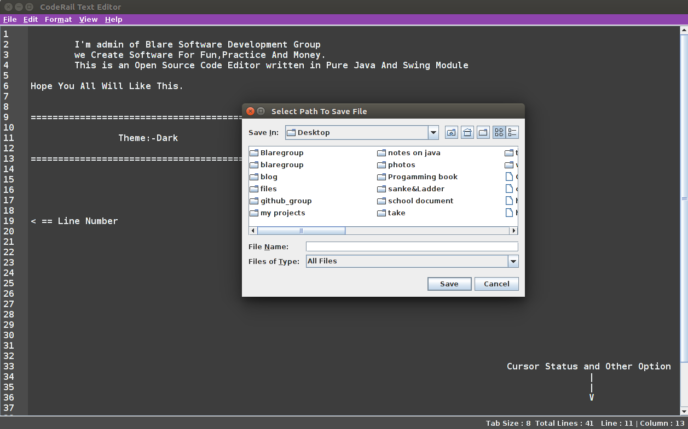
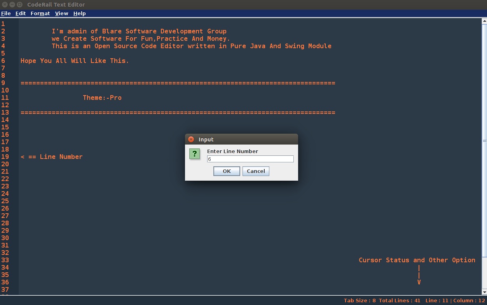

# Project CodeRail
---
A Simple Text Editor Written in Pure Java With Swing Module.

```
  ______                   __            _______             __  __ 
 /      \                 /  |          /       \           /  |/  |
/$$$$$$  |  ______    ____$$ |  ______  $$$$$$$  |  ______  $$/ $$ |
$$ |  $$/  /      \  /    $$ | /      \ $$ |__$$ | /      \ /  |$$ |
$$ |      /$$$$$$  |/$$$$$$$ |/$$$$$$  |$$    $$<  $$$$$$  |$$ |$$ |
$$ |   __ $$ |  $$ |$$ |  $$ |$$    $$ |$$$$$$$  | /    $$ |$$ |$$ |
$$ \__/  |$$ \__$$ |$$ \__$$ |$$$$$$$$/ $$ |  $$ |/$$$$$$$ |$$ |$$ |
$$    $$/ $$    $$/ $$    $$ |$$       |$$ |  $$ |$$    $$ |$$ |$$ |
 $$$$$$/   $$$$$$/   $$$$$$$/  $$$$$$$/ $$/   $$/  $$$$$$$/ $$/ $$/ 
                                                                    
                                                                    
                                                                    
```

### Introduction
This is A Simple Baby Project Started Few Weeks ago By Blare Group Just for Practise Purpose. We Tried To Make A Very Simple But Cute Looking Editor That Will Work Like A Charm And We Believe We Successfully Created It. If You Also Want to Polish Your Skill. Fork It And Do it.


This Project is Transferred From `github.com/surajsinghbisht054` Github Account. Actually, This Project was Started By BlareGroup Member name Suraj Singh And Then, Other Members Also Joined it.

### Features
	- Simple and Easy
	- Light Weight and Cross Platform
	- Supported All Average Functionality of Code Editors
	- Support Shortcut Keyboard Events
	- Support Theme, and Different Interface changes.
	- Open Source

### Getting Started.
---
Simply, Clone Github Repository or Download All Codes In Your Local Machine. Our Project Doesn't Use Any External Library. 
You Just Need to Run `run.sh` script.
This Script Automatically Compile All Codes And Run it.


### Pre Requested
---
- Java Environment


### Preview
---

---

---

---

---

---

---

---

---

### Developers/Author
- Suraj Singh Bisht [Email](surajsinghbisht054@gmail.com) [BlareGroup](www.blaregroup.com)  [Bitforestinfo](www.bitforestinfo.com)
- Himanshu Sharma [Email](himanshusharma2972@gmail.com) [BlareGroup](www.blaregroup.com)


## License

This project is licensed under the Apache License - see the [LICENSE](LICENSE) file for details

## Acknowledgments

* Hat tip to Suraj And Himanshu
